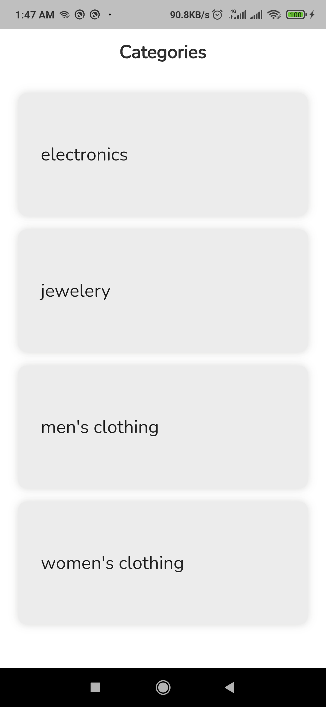

# ecommerce

A new Flutter project.
*********************************************************************************
## Getting Started

Before you begin, ensure you have met the following requirements:
- **Flutter SDK**: The flutter sdk that working with this project is 3.22.1
- **Dart SDK**: The dart sdk that working with this project is 3.4.1
*********************************************************************************
## Installation

Follow these steps to get the project up and running:
1. flutter pub get
2. dart run build_runner build --delete-conflicting-outputs
3. flutter run
*********************************************************************************
## Log in

To login to the app you must enter the following data:
1. email: bishr@gmail.com
2. password: 12345678
*********************************************************************************

## Screenshots

